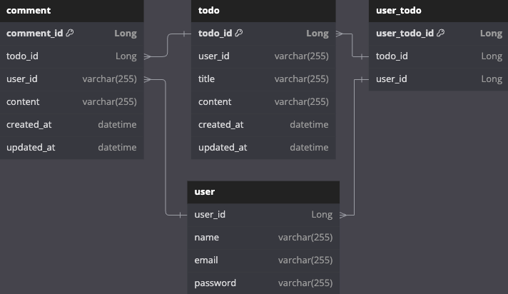

# Upgrade Schedule Management app Server
- 개발 기간 : 2024.08.20 ~ 2024.08.29
- 개발 목적 : 유저 회원가입 및 인증 인가를 활용한 일정 관리 API 서버를 구축한다.

## ERD

## API 명세 표

| 기능             | Method | URL                       | Request                                                                                                      | Response                                                                                                        | 상태 코드              |
|------------------|--------|---------------------------|-------------------------------------------------------------------------------------------------------------|-----------------------------------------------------------------------------------------------------------------|------------------------|
| 일정 생성        | POST   | /api/todos                | `{ "userId": 1, "content": "string", "password": "string" }`                                                | `{ "todoId": 1, "userId": 1, "title": "string", "content": "string", "createdAt": "2024-08-29T00:00:00", "updatedAt": "2024-08-29T00:00:00" }` | 200 OK                |
| 일정 조회        | GET    | /api/todos/{todoId}       | -                                                                                                           | `{ "title": "string", "content": "string", "users": [{ "userId": 1, "name": "John Doe", "email": "john@naver.com" }] }`                       | 200 OK                |
| 일정 전체 조회   | GET    | /api/todos                | -                                                                                                           | `[ { "todoId": 1, "userId": 1, "title": "string", "content": "string", "createdAt": "2024-08-29T00:00:00", "updatedAt": "2024-08-29T00:00:00" }]` | 200 OK                |
| 일정 수정        | PUT    | /api/todos/{todoId}       | `{ "userId": 1, "title": "string", "content": "string" }`                                                   | `{ "todoId": 1, "userId": 1, "title": "string", "content": "string", "createdAt": "2024-08-29T00:00:00", "updatedAt": "2024-08-29T00:00:00" }` | 200 OK, 403 권한 오류 |
| 일정 삭제        | DELETE | /api/todos/{todoId}       | -                                                                                                           | -                                                                                                               | 200 OK, 403 권한 오류 |
| 회원 가입        | POST   | /api/users                | `{ "adminKey": "string", "name": "John Doe", "email": "john@naver.com", "password": "string" }`             | `{ "userId": 1, "name": "John Doe", "email": "john@naver.com", "createdAt": "2024-08-29T00:00:00", "updatedAt": "2024-08-29T00:00:00" }`       | 200 OK, 403 권한 오류, 409 중복 가입 |
| 로그인           | POST   | /api/users/log-in         | `{ "email": "john@naver.com", "password": "string" }`                                                       | -                                                                                                               | 200 OK                |
| 유저 조회        | GET    | /api/users/{userId}       | -                                                                                                           | `{ "userId": 1, "name": "John Doe", "email": "john@naver.com", "createdAt": "2024-08-29T00:00:00", "updatedAt": "2024-08-29T00:00:00" }`       | 200 OK, 404 없는 유저 |
| 유저 정보 수정   | PUT    | /api/users/{userId}       | `{ "name": "string", "email": "john@naver.com" }`                                                           | `{ "userId": 1, "name": "John Doe", "email": "john@naver.com", "createdAt": "2024-08-29T00:00:00", "updatedAt": "2024-08-29T00:00:00" }`       | 200 OK, 404 없는 유저 |
| 유저 삭제        | DELETE | /api/users/{userId}       | -                                                                                                           | -                                                                                                               | 200 OK, 404 없는 유저 |
| 댓글 생성        | POST   | /api/comment/{todoId}     | `{ "userId": "string", "content": "string" }`                                                               | `{ "commentId": 1, "userId": 1, "content": "string", "createdAt": "2024-08-29T00:00:00", "updatedAt": "2024-08-29T00:00:00" }`                 | 200 OK                |
| 댓글 단건 조회   | GET    | /api/comment/{commentId}  | -                                                                                                           | `{ "commentId": 1, "userId": 1, "content": "string", "createdAt": "2024-08-29T00:00:00", "updatedAt": "2024-08-29T00:00:00" }`                 | 200 OK, 404 없는 댓글 |
| 댓글 전체 조회   | GET    | /api/comments/{todoId}    | -                                                                                                           | `[ { "commentId": 1, "userId": 1, "content": "string", "createdAt": "2024-08-29T00:00:00", "updatedAt": "2024-08-29T00:00:00", "todoId": 1 } ]`| 200 OK, 404 없는 일정 |
| 댓글 수정        | PUT    | /api/comment/{commentId}  | `{ "userId": "string", "content": "string" }`                                                               | `{ "commentId": 1, "userId": 1, "content": "string", "createdAt": "2024-08-29T00:00:00", "updatedAt": "2024-08-29T00:00:00" }`                 | 200 OK, 404 없는 댓글 |
| 댓글 삭제        | DELETE | /api/comment/{commentId}  | -                                                                                                           | -                                                                                                               | 200 OK, 404 없는 댓글 |
